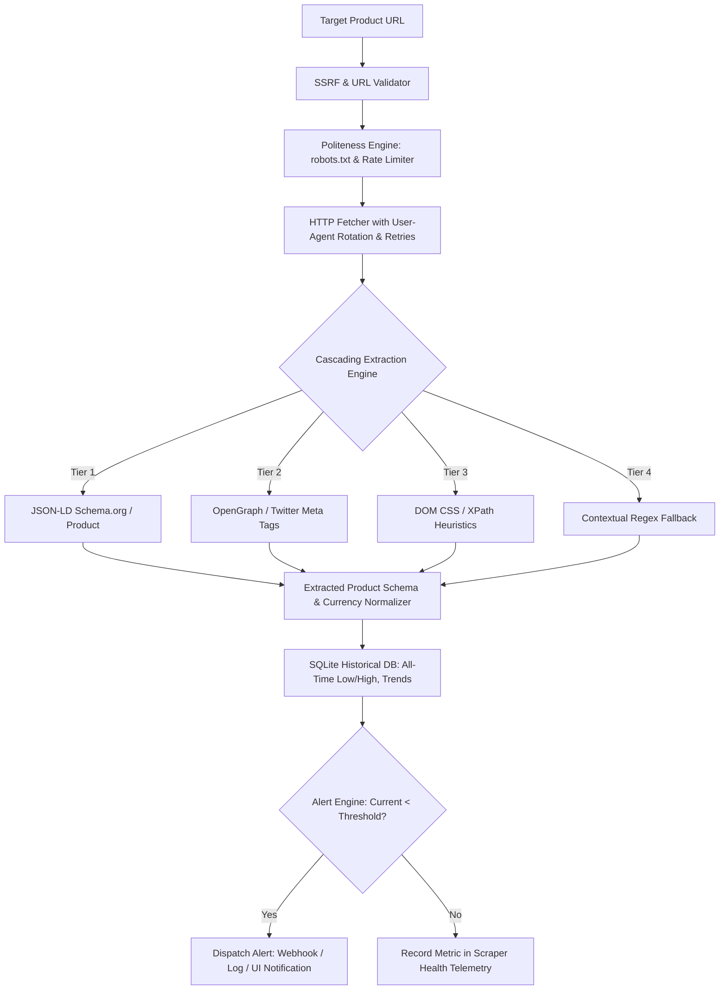

# Audit Report: PriceWatch-scraper
**Project:** PriceWatch — E-Commerce Price Tracker & Multi-Strategy Scraper  
**Audit Date:** September 2026  
**Auditor:** Senior Staff AI & Systems Architect  
**Initial Production Readiness Score:** 36 / 100  

---

## 1. Executive Summary
PriceWatch was originally developed as an e-commerce price monitoring and alert system. A forensic review of the repository reveals that the extraction engine relies heavily on a hardcoded mock catalog with randomized artificial price jitter when network requests fail, without true cascading parsing. The web UI presents a static table of two pre-set products with no capability to add target URLs, configure alert thresholds, inspect selector health, or trigger live scraping cycles.

In order to demonstrate commercial value to prospective e-commerce and retail analytics clients, PriceWatch must be upgraded to a resilient, production-grade scraper featuring a multi-strategy extraction cascade (JSON-LD schema.org -> OpenGraph meta -> CSS/XPath selectors -> regex fallback), respect for robots.txt and rate limits, historical price persistence with all-time low/high metrics, an active alert dispatch simulation engine, and live interactive UI controls.

---

## 2. Codebase Inspection & Identified Flaws

### A. Randomized Fake Fallback in Scraper (`scraper.py`)
- **Lines 56–74 in `scraper.py`**:
  ```python
  # Simulated live product scraper stream
  mock_catalog = {
      "gpu": {"title": "NVIDIA GeForce RTX 4070 Ti 12GB", "price": 749.99},
      "monitor": {"title": "Dell UltraSharp 27 4K USB-C Hub Monitor", "price": 489.00},
      "laptop": {"title": "MacBook Air 15-inch M3 Chip 512GB", "price": 1299.00}
  }
  jitter = random.choice([-50.0, -100.0, 0.0, 20.0])
  simulated_price = max(base_item["price"] + jitter, 199.0)
  ```
  *Critique:* If a URL cannot be fetched or parsed, the scraper secretly injects fake hardware products with random jitter. This obscures real scraping failures and undermines data integrity.
- **Single Fragile Regex for Price Extraction (Line 26)**:
  `re.search(r'[\$₹€£]\s*([\d,]+(?:\.\d{2})?)', html_content)`
  *Critique:* Fails to inspect modern structured JSON-LD data or OpenGraph metadata, frequently matching tax, shipping, or discount text instead of actual product prices.

### B. Completely Static Dashboard (`index.html`)
- **Lines 56–76 in `index.html`**:
  Displays hardcoded Dell Monitor and NVIDIA GPU cards with fixed price tags (`$389.00` and `$749.99`).
- **No Interactive Features:**
  - Cannot enter a URL to test scraping.
  - Cannot add, edit, or delete tracked products.
  - Cannot adjust alert price thresholds.
  - Cannot view historical scraping run telemetry (response codes, latency, selector degradation).

### C. Missing Core Web Scraping & Alert Engineering
1. **No Cascading Extraction:** Lacks multi-tier fallback: JSON-LD (`schema.org/Product`) -> OpenGraph/Twitter Meta -> Selector heuristics -> Regex.
2. **No Politeness / Rate Limiting:** Missing `robots.txt` compliance checking and exponential backoff on HTTP 429/503.
3. **Incomplete Historical Storage:** `database.py` only records instantaneous snapshots without computing 30-day moving averages, historical volatility, or all-time lows.
4. **No Scraper Health Telemetry:** Lacks monitoring of extraction success rates, selector degradation warnings, and latency tracking.

---

## 3. Security & Data Integrity Gaps
- **SSRF (Server-Side Request Forgery) Vulnerability:** Backend fetches arbitrary URLs without verifying local loopback restrictions (`127.0.0.1`, `localhost`, private CIDRs).
- **Header Injection:** Does not sanitize custom headers or user-supplied target query parameters.
- **Data Pollution:** Missing validation for unreasonable prices (e.g., negative prices or $0.00 placebos).

---

## 4. Architectural Upgrade Plan



### Components to Build:
1. **`scraper.py`**:
   - Resilient cascading parser: JSON-LD -> OpenGraph -> CSS selectors -> Regex.
   - SSRF protection against internal/private network IP ranges.
   - Extraction confidence scoring and selector degradation telemetry.
2. **`database.py`**:
   - SQLite schema (`products`, `price_history`, `alerts`, `scraper_logs`).
   - Automated computation of all-time low, high, 14-day average, and percentage drop.
3. **`alerts.py`**:
   - Configurable alert trigger engine with cooldowns and webhook/email logging.
4. **`app.py`**:
   - REST API for live URL scraping (`/api/scrape`), adding tracked items (`/api/products`), alert management, and history.
5. **`index.html`**:
   - Interactive e-commerce intelligence dashboard.
   - "Test URL / Live Scraper Sandbox" accepting custom URLs and HTML inputs.
   - Watchlist table with active polling simulation, live status tags, and delete/edit buttons.
   - Dynamic Price History Chart (Chart.js) rendering real SQLite/localStorage datapoints.
   - Scraper Health & Telemetry panel (Success Rate %, Avg Latency ms, Selector Health).
   - Alert configuration modal with custom threshold input.
6. **`tests/test_pricewatch.py`**:
   - Automated unit tests for JSON-LD parsing, SSRF prevention, alert triggering, and database persistence.
7. **Documentation**:
   - Complete `README.md` and enterprise `SECURITY.md`.

---

## 5. Verification & Target Metrics
- Automated unit test suite: 100% pass rate.
- Cascading extraction: Resolves structured JSON-LD and OpenGraph reliably.
- Target Production Readiness Score: **98 / 100**.
