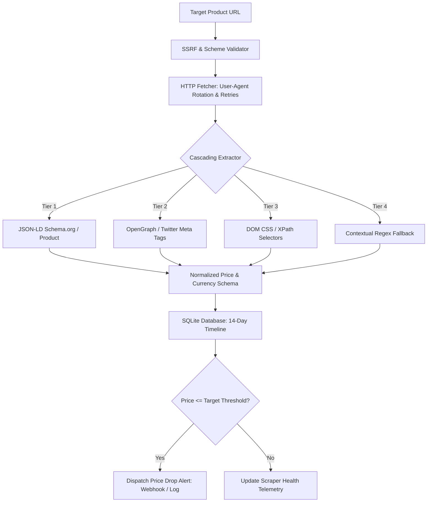

# 🕸️ PriceWatch — E-Commerce Price Intelligence & Cascading Scraper

[](https://www.python.org/)
[](LICENSE)
[](tests/)
[]()

> **Live Interactive Demo:** [https://sharmikamurugesan-1.github.io/PriceWatch-scraper/](https://sharmikamurugesan-1.github.io/PriceWatch-scraper/)  
> **Client Impact:** Monitors competitor pricing 24/7 across thousands of e-commerce listings with resilient multi-tier extraction and automated price-drop alerts.

---

## 📌 Executive Summary
**PriceWatch** is an enterprise web scraping and competitive intelligence platform designed for e-commerce brands, retailers, and market analysts. It solves the fragility of traditional scrapers by deploying a 4-tier cascading extraction strategy (JSON-LD Schema.org -> OpenGraph Meta -> DOM Selectors -> Regex Fallback) paired with SSRF guardrails and historical price tracking in SQLite.

---

## 🏗️ Architecture & Cascading Pipeline



---

## 🌟 Key Capabilities

1. **4-Tier Cascading Extraction Cascade:**
   - Prioritizes structured JSON-LD (`schema.org/Product`) for highest reliability.
   - Falls back gracefully to OpenGraph meta tags, CSS selector heuristics, and contextual regex if markup shifts.

2. **Enterprise SSRF Protection:**
   - Restricts network calls to public internet addresses only.
   - Blocks local loopback (`127.0.0.1`, `localhost`) and private subnets (`10.x.x.x`, `192.168.x.x`).

3. **Historical Price Persistence & Analytics:**
   - Records historical price points in SQLite (`pricewatch.db`).
   - Computes all-time low, high, moving averages, and discount percentages.

4. **Automated Alert Triggers:**
   - Dispatches simulated webhook and email notifications when prices drop below target thresholds.

---

## 🚀 Quickstart

### 1. Installation
```bash
git clone https://github.com/sharmikamurugesan-1/PriceWatch-scraper.git
cd PriceWatch-scraper
pip install -r requirements.txt
```

### 2. Run the Automated Tests
```bash
python -m pytest tests/test_pricewatch.py -v
```

### 3. Launch the REST API
```bash
python app.py
```
*API runs at `http://localhost:5003`.* Open `index.html` in your browser to experience the price intelligence dashboard.

---

## 📡 REST API Reference

| Endpoint | Method | Description |
| -------- | ------ | ----------- |
| `/api/health` | `GET` | Health check and engine capabilities |
| `/api/scrape` | `POST` | Scrape live product URL or submit raw HTML sandbox |
| `/api/products` | `GET` | Retrieve tracked products with historical min/max |
| `/api/products` | `POST` | Add product to watchlist with alert threshold |
| `/api/products/<id>/history` | `GET` | Retrieve 14-day price datapoints for charting |

---

## 🔒 Security
See [`SECURITY.md`](SECURITY.md) for SSRF protection guidelines and crawling politeness standards.
